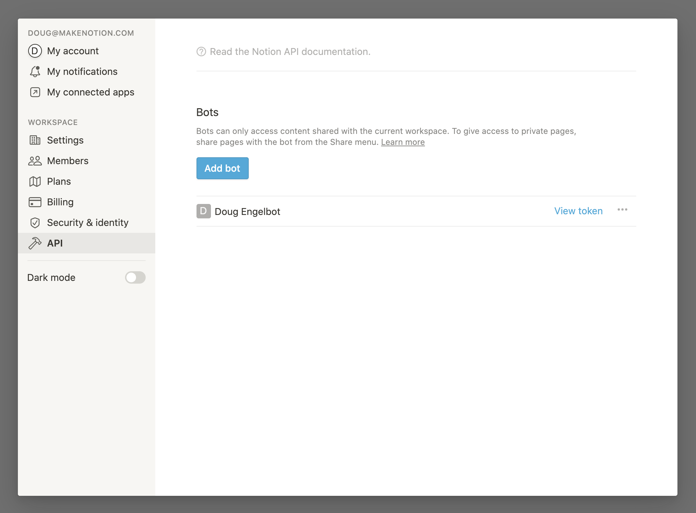

# Notion Ruby Client

A Ruby client for the Notion API.

## Table of Contents

- [Installation](#installation)
- [Usage](#usage)
  - [Create a New Bot Integration](#create-a-new-bot-integration)
  - [Declare the API token](#declare-the-api-token)
  - [API Client](#api-client)
    - [Instantiating a new Notion API client](#instantiating-a-new-notion-api-client)
- [Endpoints](#endpoints)
  - [Databases](#databases)
    - [Query a database](#query-a-database)
    - [Retrieve a database](#retrieve-a-database)
    - [List databases](#list-databases)
    - [Create a Database](#create-a-database)
  - [Pages](#pages)
    - [Create a page](#create-a-page)
    - [Retrieve a page](#retrieve-a-page)
    - [Update page](#update-page)
  - [Blocks](#blocks)
    - [Retrieve block children](#retrieve-block-children)
    - [Append block children](#append-block-children)
  - [Users](#users)
    - [List all users](#list-all-users)
    - [Retrieve a user](#retrieve-a-user)

## Installation

Add to Gemfile.

```
gem 'notion-ruby-client'
```

Run `bundle install`.

## Usage

### Create a New Bot Integration

To integrate your bot with Notion, you must first [create a new Notion Bot](https://www.notion.so/Getting-started-da32a6fc1bcc4403a6126ee735710d89).

1. Log into the workspace that you want your integration to be associated with.
2. Confirm that you are an Admin in the workspace (see Settings & Members > Members).
3. Go to Settings & Members, and click API



### Declare the API token

```ruby
Notion.configure do |config|
  config.token = ENV['NOTION_API_TOKEN']
end
```

For Rails projects, the snippet above would go to `config/application.rb`.

### API Client

#### Instantiating a new Notion API client

```ruby
client = Notion::Client.new
```

You can specify the token or logger on a per-client basis:

```ruby
client = Notion::Client.new(token: '<secret Notion API token>')
```

## Endpoints

### Databases

#### Query a database

Gets a paginated array of [Page](https://developers.notion.com/reference/page) objects contained in the database, filtered and ordered according to the filter conditions and sort criteria provided in the request.

```ruby
client.database_query(id: 'e383bcee-e0d8-4564-9c63-900d307abdb0')  # retrieves the first page

client.database_query(id: 'e383bcee-e0d8-4564-9c63-900d307abdb0', start_cursor: 'fe2cc560-036c-44cd-90e8-294d5a74cebc')

client.database_query((id: 'e383bcee-e0d8-4564-9c63-900d307abdb0') do |page|
  # paginate through all pages
end

# Filter and sort the database
sort = [
  {
    "property": "Last ordered",
    "direction": "ascending"
  }
]
filter = {
  "or": [
    {
      "property": "In stock",
      "checkbox": {
        "equals": true
      }
    },
    {
      "property": "Cost of next trip",
      "number": {
        "greater_than_or_equal_to": 2
      }
    }
  ]
}
client.database_query(id: 'e383bcee-e0d8-4564-9c63-900d307abdb0', sort: sort, filter: filter)
```

#### Retrieve a database

Retrieves a [Database object](https://developers.notion.com/reference-link/database) using the ID specified.

```ruby
client.database(id: 'e383bcee-e0d8-4564-9c63-900d307abdb0')
```

#### List databases

List all [Databases](https://developers.notion.com/reference-link/database) shared with the authenticated integration.

```ruby
client.databases_list # retrieves the first page

client.databases_list(start_cursor: 'fe2cc560-036c-44cd-90e8-294d5a74cebc')

client.databases_list do |page|
  # paginate through all databases
end
```

#### Create a Database

Creates a database as a subpage in the specified parent page, with the specified properties schema.

```ruby
title = [
  {
    "type": "text",
    "text": {
      "content": "Grocery List",
      "link": nil
    }
  }
],
properties = {
  "Name": {
    "title": {}
  },
  "Description": {
    "rich_text": {}
  },
  "In stock": {
    "checkbox": {}
  },
  "Food group": {
    "select": {
      "options": [
        {
          "name": "🥦Vegetable",
          "color": "green"
        },
        {
          "name": "🍎Fruit",
          "color": "red"
        },
        {
          "name": "💪Protein",
          "color": "yellow"
        }
      ]
    }
  }
}
client.create_database(
  parent: { page_id: '98ad959b-2b6a-4774-80ee-00246fb0ea9b' },
  title: title,
  properties: properties
)
```

### Pages

#### Create a page

Creates a new page in the specified database or as a child of an existing page.

If the parent is a database, the [property values](https://developers.notion.com/reference-link/page-property-value) of the new page in the properties parameter must conform to the parent [database](https://developers.notion.com/reference-link/database)'s property schema.

If the parent is a page, the only valid property is `title`.

The new page may include page content, described as [blocks](https://developers.notion.com/reference-link/block) in the children parameter.

```ruby
properties = {
  "Name": {
    "title": [
      {
        "text": {
          "content": "Tuscan Kale"
        }
      }
    ]
  },
  "Description": {
    "rich_text": [
      {
        "text": {
          "content": "A dark green leafy vegetable"
        }
      }
    ]
  },
  "Food group": {
    "name": "🥦 Vegetable"
  },
  "Price": 2.5
}
children = [
  {
    "object": "block",
    "type": "heading_2",
    "heading_2": {
      "text": [{ "type": "text", "text": { "content": "Lacinato kale" } }]
    }
  },
  {
    "object": "block",
    "type": "paragraph",
    "paragraph": {
      "text": [
        {
          "type": "text",
          "text": {
            "content": "Lacinato kale is a variety of kale with a long tradition in Italian cuisine, especially that of Tuscany. It is also known as Tuscan kale, Italian kale, dinosaur kale, kale, flat back kale, palm tree kale, or black Tuscan palm.",
            "link": { "url": "https://en.wikipedia.org/wiki/Lacinato_kale" }
          }
        }
      ]
    }
  }
]
client.create_page(
   parent: { database_id: 'e383bcee-e0d8-4564-9c63-900d307abdb0'},
   properties: properties,
   children: children
)
```

#### Retrieve a page

Retrieves a [Page object](https://developers.notion.com/reference-link/page) using the ID specified.

> :blue_book: Responses contains page **properties**, not page content. To fetch page content, use the [retrieve block children](#retrieve-block-children) endpoint.

```ruby
client.page(id: 'b55c9c91-384d-452b-81db-d1ef79372b75')
```

#### Update page

Updates [page property values](https://developers.notion.com/reference-link/page-property-value) for the specified page. Properties that are not set via the `properties` parameter will remain unchanged.

If the parent is a database, the new [property values](https://developers.notion.com/reference-link/page-property-value) in the `properties` parameter must conform to the parent [database](https://developers.notion.com/reference-link/database)'s property schema.

```ruby
properties = {
  "In stock": true
}
client.update_page(id: 'b55c9c91-384d-452b-81db-d1ef79372b75', properties: properties)
```

### Blocks

#### Retrieve block children

Returns a paginated array of child [block objects](https://developers.notion.com/reference-link/block) contained in the block using the ID specified. In order to receive a complete representation of a block, you may need to recursively retrieve the block children of child blocks.

```ruby
client.block_children(id: 'b55c9c91-384d-452b-81db-d1ef79372b75')

client.block_children(start_cursor: 'fe2cc560-036c-44cd-90e8-294d5a74cebc')

client.block_children_list do |page|
  # paginate through all children
end
```

#### Append block children

Creates and appends new children blocks to the parent block `id` specified.

Returns a paginated list of newly created first level children block objects.

```ruby
children = [
  {
    "object": 'block',
    "type": 'heading_2',
    "heading_2": {
      "text": [{ "type": 'text', "text": { "content": 'A Second-level Heading' } }]
    }
  }
]
client.block_append_children(id: 'b55c9c91-384d-452b-81db-d1ef79372b75', children: children)
```

### Users

#### List all users

Returns a paginated list of [Users](https://developers.notion.com/reference/user) for the workspace.

```ruby
client.users_list # retrieves the first page

client.users_list(start_cursor: 'fe2cc560-036c-44cd-90e8-294d5a74cebc')

client.users_list do |page|
  # paginate through all users
end
```

#### Retrieve a user

Retrieves a [User](https://developers.notion.com/reference/user) using the ID specified.

```ruby
client.user(id: 'd40e767c-d7af-4b18-a86d-55c61f1e39a4')
```
